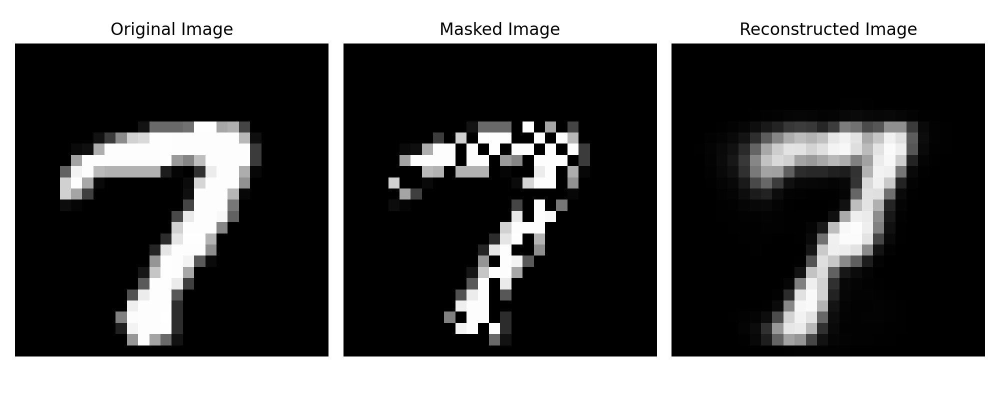

## Restricted Boltzmann Machine (RBM) for MNIST Digit Inpainting

### 1. Theory

A **Restricted Boltzmann Machine (RBM)** is a generative stochastic neural network that learns a probability distribution over its input data. It consists of two layers:
- **Visible layer** $v$: Represents the observed data (e.g., pixel values of images).
- **Hidden layer** $h$: Captures latent features and dependencies in the data.

The RBM models the joint probability of the visible and hidden units using an **energy function**:

$$
E(v, h) = -v^\top W h - b^\top v - c^\top h
$$

Where:
- $v$ is the vector of visible units,
- $h$ is the vector of hidden units,
- $W$ is the weight matrix between the visible and hidden units,
- $b$ and $c$ are the biases for the visible and hidden layers, respectively.

The RBM learns by minimizing the energy of the observed data and maximizing the energy of reconstructed data through **Contrastive Divergence (CD)**. The learning process alternates between the visible and hidden layers using **Gibbs sampling** to update the weights $W$ and biases $b, c$.

The probability of a hidden unit being activated given the visible units is:

$$
P(h_j = 1 | v) = \sigma\left( \sum_i v_i W_{ij} + c_j \right)
$$

And similarly, the probability of a visible unit being activated given the hidden units is:

$$
P(v_i = 1 | h) = \sigma\left( \sum_j h_j W_{ij} + b_i \right)
$$

Where $ \sigma(x) = \frac{1}{1 + e^{-x}} $ is the sigmoid activation function.

### 2. Methodology

For this project, the RBM was trained on the **MNIST dataset** to perform **digit inpainting**, i.e., reconstruct missing pixels in masked digits. The steps were as follows:
- The **MNIST dataset** was split into training and test sets.
- A **binary RBM** was trained using **contrastive divergence** with 5 Gibbs sampling steps.
- **Masked images** were created by randomly masking 50% of the pixels in the original digits.
- The RBM was tasked with reconstructing the missing pixels based on the patterns it learned during training.
- The learned hidden weights were visualized to understand how the model captured important features of the digits.

### 3. Results

After an investigation of the learning rate $\eta$, number of Gibb's sampling steps $\kappa$, number of epochs, batch size and number of hidden units, the best results are presented below.

#### Figure 1: MNIST Digit Reconstruction
Below is a comparison of the original digit, the masked version of the digit, and the RBM's reconstruction:

- **Original Image**: The actual digit from the MNIST dataset.
- **Masked Image**: The image with 50% of the pixels randomly masked.
- **Reconstructed Image**: The RBM's attempt to fill in the missing pixels.

#### Figure 2: Hidden Weights Visualization
The following figure shows the learned weights of the hidden layer of the RBM. Each small image represents the weights associated with one hidden unit.

### 4. Generative Use
The model can also be used to generate new images of digits.

  

